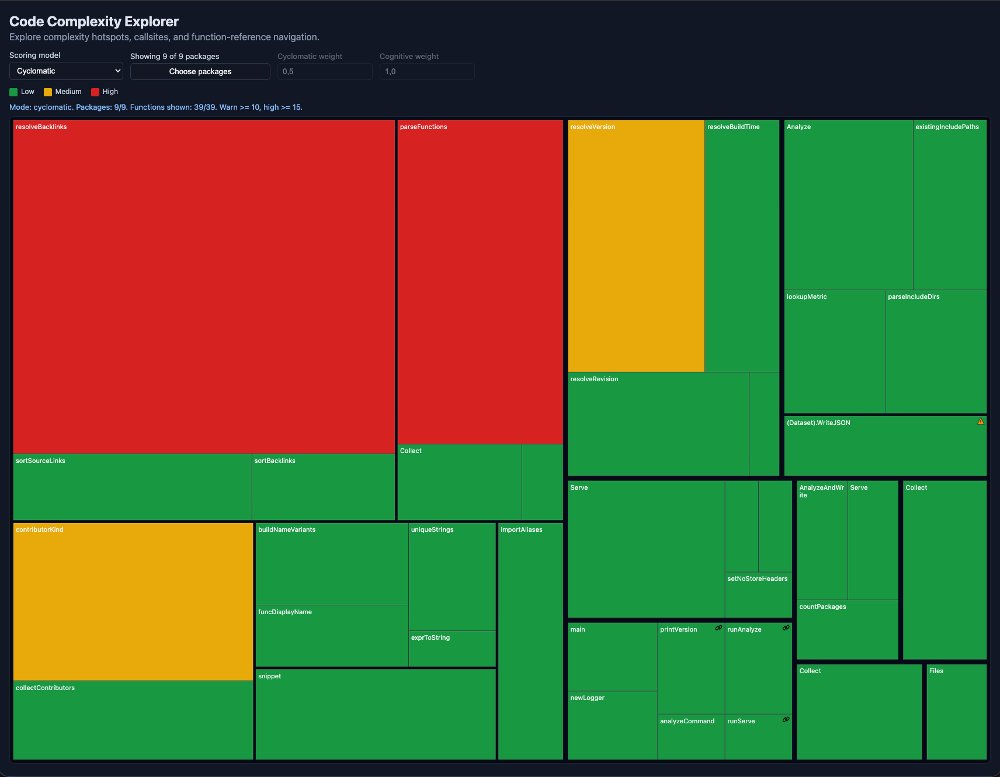
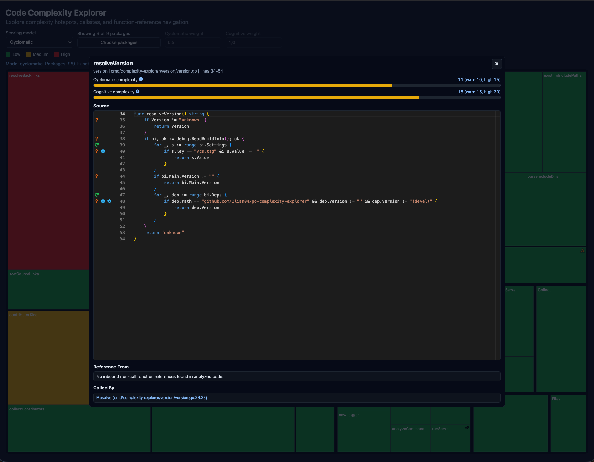

# Complexity Explorer

An interactive **complexity explorer for Go codebases**. Point it at any Go
repository and it analyzes every function in-place, computes cyclomatic and
cognitive complexity, and serves an embedded web UI that lets you:

- See the whole codebase as a **treemap** sized and colored by complexity, so
  hotspots stand out at a glance.
- Click any function tile to open an **inspector** with the function's source,
  control-flow markers, recursion warnings, and a clickable call graph
  (callers and inbound function-value references).



The UI and analysis run entirely on your machine — no telemetry, no cloud
service, no dependencies on the analyzed code being part of any particular
project layout.

## What it is

- A **read-only exploration tool** for understanding where complexity lives
  in a Go codebase.
- A **single static binary** with the web UI embedded — start it once, open
  the browser, done.
- A way to make **code review and onboarding** conversations concrete: "this
  function is the red tile, here are its 14 callers, here is why it's red."

## What it isn't

- **Not a linter or a CI gate.** It doesn't fail builds, set thresholds, or
  block merges. There are no rules to configure.
- **Not a refactoring tool.** It doesn't rewrite or transform your code.
- **Not a profiler.** It measures *static* code structure, not runtime
  performance, allocations, or coverage.
- **Not a dependency / package analyzer.** It works at the function level.

## Install

Install with the standard Go toolchain (Go 1.26+):

```bash
go install github.com/Olian04/go-complexity-explorer/cmd/complexity-explorer@latest
```

This drops a `complexity-explorer` binary into `$(go env GOBIN)` (or
`$(go env GOPATH)/bin` if `GOBIN` is unset). Make sure that directory is on
your `PATH`.

To upgrade later, run the same command again — `@latest` always pulls the
newest tagged release.

## Use

### Explore a repo in the browser (default)

Running the binary with no subcommand analyzes the target repository and
serves the inspector UI:

```bash
cd path/to/your/go/repo
complexity-explorer
```

Then open <http://localhost:8787/>.

Common flags:

| Flag        | Default | Meaning                                                  |
|-------------|---------|----------------------------------------------------------|
| `--root`    | `.`     | Repository root to analyze.                              |
| `--include` | `.`     | Comma-separated directories under `--root` to scan.      |
| `--addr`    | `:8787` | HTTP listen address.                                     |

Example — analyze only `internal/` and `cmd/` of a repo, on port `9000`:

```bash
complexity-explorer --root . --include internal,cmd --addr :9000
```

The server logs analysis progress, then every HTTP request, and shuts down
gracefully on `Ctrl+C` / `SIGTERM`.

### Dump the analysis as JSON

For scripting or one-off snapshots, use the `analyze` subcommand:

```bash
complexity-explorer analyze \
  --root . \
  --include . \
  --output ./complexity.json
```

The JSON contains every function's identity, complexity scores, and inspector
payload (source, contributors, backlinks).

### Help and version

```bash
complexity-explorer --help     # or -h
complexity-explorer --version  # or -v
```

## Reading the results

### The treemap (overview)

Each tile is one **function**, grouped by **package → file → function**.

- **Tile size** is proportional to that function's score in the active
  scoring model.
- **Tile color** reflects severity, using the legend at the top of the page:
  - **Green** — low: score below the warn threshold.
  - **Yellow** — medium: score at or above the warn threshold.
  - **Red** — high: score at or above the high threshold.

  Default thresholds are `warn=10, high=15` for cyclomatic and
  `warn=15, high=20` for cognitive. The "max" model uses the larger of the
  two; the "weighted" model scales each threshold by the weights you set in
  the controls.

#### Scoring model selector

The dropdown in the top bar switches what each tile measures:

- **Cyclomatic** — number of linearly independent paths through the function.
- **Cognitive** — how hard the function is to *read* (penalizes nesting and
  combined boolean logic, not just branch count).
- **Max(cyclomatic, cognitive)** — whichever is worse.
- **Weighted sum** — `cyclomatic_weight × cyclomatic + cognitive_weight ×
  cognitive`. Use the two number inputs to tune.

#### Treemap markers

Some tiles carry a small badge in the corner:

- **`!` triangle (warning)** — no inbound callsites were found in the analyzed
  code. The function may be dead, or only reachable via reflection / build
  tags. The `main` function of `main` packages is exempt.
- **Chain-link icon (hook)** — no direct callsites, **but** the function is
  referenced as a value (e.g. exported `On*` / `Handle*` methods, function
  values passed into a third-party struct). It is probably called by
  dependency code rather than your code.

Click a tile — including a tile with a marker — to open the inspector.

### The inspector (function detail)



The modal that opens when you click a tile shows:

- **Score bars** for cyclomatic and cognitive complexity, each colored by the
  same low/medium/high thresholds, with hoverable info icons explaining what
  each metric measures.
- **Source view** (Monaco editor) of just that function's body.
- **Reference From** — places that take the function as a value (callbacks,
  function-typed fields).
- **Called By** — places that call the function directly. Each entry is a
  link that navigates the inspector to that caller.

#### Gutter icon legend (inspector)

The left-hand gutter of the source view shows one icon per line that
contributes to the complexity score. Hovering an icon explains what it
matched.

- **`?` question mark, orange** *(medium)* — an `if` / `else if` branch.
- **Circular arrow, green** *(medium)* — a `for` or `range` loop.
- **Forking branch lines, red** *(high)* — a `switch`, type-switch, or
  `select` statement.
- **Puzzle piece, amber** *(medium)* — a `case` or `comm` clause arm.
- **Gear, sky blue** *(low)* — a short-circuit boolean operator
  (`&&` / `||`).
- **Map pin, violet** *(low)* — another control-flow construct not covered
  above.
- **Curved "undo" arrow, teal** *(medium)* — **direct recursion**: the
  function calls itself on this line.
- **Two opposing rotate arrows, pink** *(high)* — **cyclic recursion**: this
  call enters a deeper chain that eventually loops back to the function.
- **Horizontal ellipsis (…)** — overflow marker: more contributors exist on
  this line than there are visible icon slots. Hover for the full list.

Underlined identifiers in the source view are **clickable function links** —
click them to jump the inspector to that target function. Use them together
with the **Called By** / **Reference From** lists to walk the call graph
without leaving the page.

## Contributing

Architecture, package layout, and conventions for contributors are documented
in [`docs/AGENT_CONTEXT.md`](./docs/AGENT_CONTEXT.md).
